# MathsBuddy
MathsBuddy is a website that provides online learning for maths to students who wish to take the Junior Cycle exam.

## Overview

### Who is this app for?
 
MathsBuddy is a website which provides resources for students who will be taking the Junior Cycle exam in Ireland.  These students will be aged between 14 and 16 years old.  MathsBuddy is a website which will be used by students who are in high-risk families and are not entitled to online instruction from the department of education.  
 
### What does it do?
 MathsBuddy hopes to bridge the gap during the current covid-19 crisis by offering an opportunity to solidify maths concepts up to Junior Cycle level.
 
### How does it work
 
MathsBuddy gives access to tutorial videos and past exam questions, broken down by topic, for the Junior Cycle maths exam.

## Screen Mockups
These screen mockups were created for the MathsBuddy website using the [Multi Device Website Mockup Generator](https://techsini.com/multi-mockup/index.php) from techsini.com.

**Home Page**


**Maths Page**


**About Page**


**Contact Us Page**


**Number Types Page**


**Co-ordinate Geometry Page**


**Algebra Page**


**Trigonometry Page**


**Number Types Exam Questions Page**


**Co-ordinate Geometry Exam Questions Page**


**Algebra Exam Questions Page**


**Trigonometry Exam Questions Page**


**404 error Page**


## Features

### Existing Features
1 Site navigation
On the MathsBuddy website each page has a header at the top of the page which contains a logo and a NavBar.  On any page if the student clicks the logo they will be redirected to the MathsBuddy home page.
The NavBar contains links to the 4 main pages (Home, Maths, About and Contact Us).

The NavBar is used so that the student can navigate easily between the major sections of the MathsBuddy website, on every device.

On each of the topic video pages, which are navigated to from the Maths page, there is also a breadcrumb navigation bar.  This breadcrumb navigation bar serves a number of purposes.  Firstly, it allows the student to navigate from one topic page to another, rather than having to go back to the Maths page each time they wish to go from one topic page to another.  Secondly, it allow the student to navigate back up to the parent(Maths) page easily.  Thirdly, the breadcrumb shows the student exactly where they are in the MathsBuddy website.  Students will never feel lost when they use MathsBuddy.

On each of the topic exam questions pages, which are navigated to from the topic video page, there is also a breadcrumb navigation bar.  This breadcrumb navigation bar serves a number of purposes.  Firstly, it allows the student to navigate from one exam question page to another, rather than having to go back to the topic video page each time they wish to go from one exam question page to another.  Secondly, it allow the student to navigate back up to the parent pages easily, both to the topic video page and the Maths page.  Thirdly, the breadcrumb shows the student exactly where they are in the MathsBuddy website.  Students will never feel lost when they use MathsBuddy.


2 Show videos on each topic
Each topic video page shows 3 videos relating to the topic, except the Trigonometry topic video page which show one image and 2 videos.  None of the videos will play automatically.  All of them have user controls.

Students can click on whichever of these videos they want to watch.  They can expand it to full screen, pause, restart, mute, choose to go back or forward on the video if they wish.

This gives the student full control over a multi-sensory, multimedia learning tool.  Learning is greatlly enhanced for every new sense that is used when studying.  These videos give the student the best chance to retain information from their study session with MathsBuddy.

These videos come from two distinct types of source:

       2.1 Videos stored locally

       2.2 Videos from external sources.  E.g. Youtube, Khan Academy

3 Display past exam papers for each topic
Since the end goal of the Junior Cycle maths programme is for students to sit a formal Department of Education exam, it is imperative that the student has access to questions on each topic that are of the same standard as those that will appear on the exam.

The benefit of having past exam papers on the MathsBuddy website to work through, is that the student will be practising questions that are of the same standard that they will encounter during the exam.  This is a key part of the preparation for any exam, but especially for the Junior Cycle exam which will be the first externally set exam that most students will sit.

### Features to Implement in the future
- Send the 'Contact Us' form data to a backend server.
- Use a collapsible navbar in mobile versions of the site.
- Add more maths topics.
- Add more past papers exam questions.

## UX

### Personas

**External link to [Emily's Persona](https://app.flowmapp.com/share/18b55dee67b0693f1bbb1ea1f87e5526/personas/45989/)**


**External link to [Daniel's Persona](https://app.flowmapp.com/share/18b55dee67b0693f1bbb1ea1f87e5526/personas/45996/)**


### Student Journey Maps

**External link to [Emily's Journey Map](https://app.flowmapp.com/share/18b55dee67b0693f1bbb1ea1f87e5526/cjm/26580/)**


**External link to [Daniel's Journey Map](https://app.flowmapp.com/share/18b55dee67b0693f1bbb1ea1f87e5526/cjm/26876/)**


### User Flow

**External link to [User Flow](https://app.flowmapp.com/share/18b55dee67b0693f1bbb1ea1f87e5526/userflow/164243/)**


### Site Map

**External link to [Site Map](https://app.flowmapp.com/share/18b55dee67b0693f1bbb1ea1f87e5526/sitemap/)**


### Accessibility

The MathsBuddy website was checked to ensure accessibility using the [WAVE](https://wave.webaim.org/) web accessibility evaluation tool.

**Home Page**


**Maths Page**


**About Page**


**Contact Us Page**


**Number Types Page**


**Co-ordinate Geometry Page**


**Algebra Page**


**Trigonometry Page**


**Number Types Exam Questions Page**


**Co-ordinate Geometry Exam Questions Page**


**Algebra Exam Questions Page**


**Trigonometry Exam Questions Page**


**404 error Page**


## Design Decisions
### Code Quality
- Correct use of HTML 
    - Use HTML5 Semantic elements
    - Use Horizontal NavBar
- Correct use of CSS 
    - Use Flexbox for page layout
	
### Usability
- Suitability for purpose
    - MathsBuddy provides resources that cover maths topics for the Junior Cycle.
    - MathsBuddy provides access to past exam questions from the maths Junior Cycle exams.
    - MathsBuddy provides resources and exam questions for both Paper 1 and Paper 2 on the Junior Cycle exam.
    - Covers Number Types (paper 1), Algebra(paper 1), Co-ordinate Geometry(paper 2) and Trigonometry (paper 2)
- Ease of use
    - A simple easy-to-use application focusing on reducing the 'cognitive load' on students.  The system is designed so that students do not have to remember large amounts of detail.
- Information Display 
    - There is a main navigation bar on every page.  This allows navigation to all the main pages (Home, Maths, About and Contact Us) from everywhere on the site.
    - For the Topics pages, as well as the main navigation bar, there is a secondary (breadcrumb) navigation that allows the student to (i) go back to the parent page (Maths), or (ii) go to the previous and next topic pages.
    - For the Exam Question pages, as well as the main navigation bar, there is a secondary (breadcrumb) navigation that allows the student to (i) go back to either of the parent pages (Maths or the topic page), or (ii) go to the previous and next exam question pages.

### Layout and Visual Impact
- Responsive Design 
    - "Desktop First" design philosophy
    - FlexBox is used to give responsive layouts
    - Media Queries are used for each different screen size the tool will be used on.
- Navigation 
    - Straightforward navigation enabling students to move easily from one part of the site to another.
    - When a student ventures onto a page which is not navigable from the main navigation bar, a secondary breadcrumb navigation bar is engaged, which allows the student to navigate all the way back to a main page.
    - The secondary breadcrumb navigation bar also allows the student to go to the next and previous pages at the same level.  I.E.  If the student is on the Number types *topic* page, he can go to the Algebra *topic* page or the Trigonometry *topic* page.  Also, if the student is on the Number types *exam questions* page, he can go to the Algebra *exam questions* page or the Trigonometry *exam questions* page.
- Image Treatment 
    - Images are compressed to reduce download times.  [tinypng.com](https://tinypng.com) and [tinyjpg.com](https://tinyjpg.com) were used to compress the  image files.
    - Multiple versions of each image are used, with smaller images used for smaller devices.  This reduces the download times for tablets and especially mobile devices.  The HTML5 *source* element is used and its *srcset* attribute is set to show the smaller image at lower screen widths.  For background images, a media query is used in CSS to set the background image to a smaller image when the screen size falls below a particular size.
- Non-image Treatment 
    - All videos are made available in mp4, webm and ogg formats.  Videos were converted to webm format using [wem.to](https://webm.to/video-webm), and to ogg format using [onlineconverter.com](https://www.onlineconverter.com/video-to-ogg). The HTML5 *source* element is used and its *src* attribute is set to point to the correct version. Its *type* attribute is set to tell the browser which format this src is pointing to.
    - Text is set within the *video* element. This text will be displayed if the student's browser does not support the video element.
    - The video on the home page is set to play automatically and to loop.  This is because the video is intended as a background video, its sound is muted and the colours have a low saturation so they will not distract the student.
    - All other videos are not autoplay and allow the student to control their playback.
    - Some videos are served from the MathsBuddy site.
    - Videos served from external sites are displayed within an iframe.
    - For contrast reasons to make the MathsBuddy website accessible to those with vision impairment, text is shown either as dark text on a light background, or light text on a dark background.
  

#### Wireframes

**Home Page**

**Maths Page**

**About Page**

**Contact Us Page**

**Topic Video Page**

**Topic Exam Questions Page**


### Software Development Process
#### Version Control 
**Git** is used for version control of this project
- Git commit message prefix convention denoting the type of change made in this commit:
    - DOC: Documentation
    - FEAT: Feature
    - FIX: Bugfix
    - STYLE: Changes to CSS
    - ARIA: Changes to improve accessibility for the MathsBuddy website.
- Git messages will be no longer than 50 characters long.

**GitHub** is used as the central version control repository for this project.

#### Testing 
All testing on the MathsBuddy website will be done manually.

**Heuristic Evaluation**
Heuristic testing is performed where there an expert in the particular field is not available.  However, an expert has laid out a set of rules for testing.  The non-expert tester can follow these heuristic set of rules, and apply them in place of an expert tester.

For the MathsBuddy website, a set of heuristic rules developed by Jakob Nielson, an expert in usability, will be used to test the usability of the website.

No | Heuristic test | MathsBuddy
-- | --- | --- 
1 | Visibility of system status | Navbar indicates where in the site the user is
 2 | Match between system and real world | Real exam questions
3 | User control and freedom | Full navigation, control on videos
4 | Consistency and standards | Same navigation on all pages, layouts are the same
5 | Error prevention | All links are working
6 | Flexibility & Efficiency of use | Student can go from on topic to the next easily, or navigate back using breadcrumb
7 | Aesthetic & minimalist design | Minimal content is shown, e.g. only videos needed and a button to go to exam pages
8 | Recognition rather than recall | Each topic page is laid out the same way
9 | Help users recognise, diagnose and recover from errors | 404 error page


The MathsBuddy website will be tested on the following browsers:
 - Firefox
 - Chrome

The MathsBuddy website will be tested on the following devices:
 - Laptop = HP EliteBook 8570p
 - Tablet (Landscape orientation) = Huawei MediaPad M5 10.1"
 - Tablet (Landscape orientation) = Huawei MediaPad M5 10.1"
 - Phone = Samsung Galaxy A10
 
##### **Test scripts**

**Home page - Laptop - Firefox**
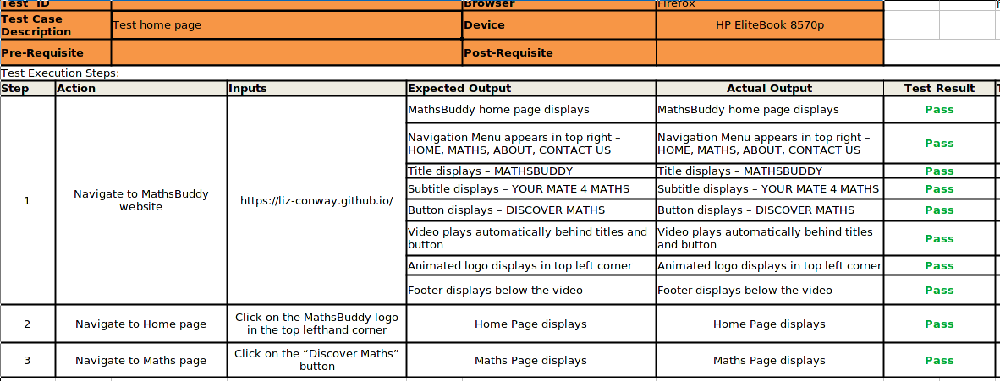

**Home page - Laptop - Chrome**
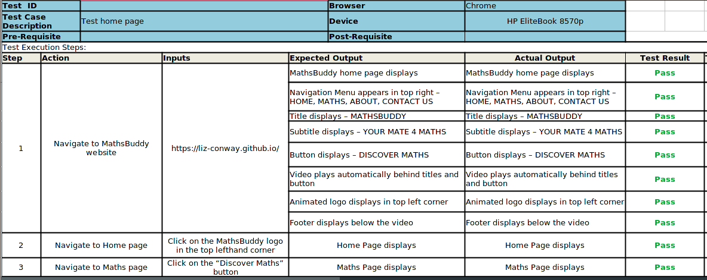

**Home page - Tablet Landscape - Firefox**
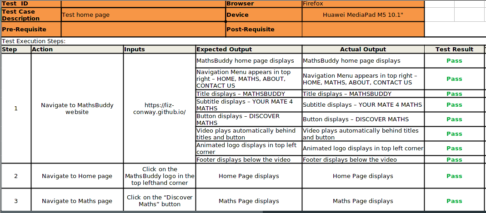

**Home page - Tablet Landscape - Chrome**
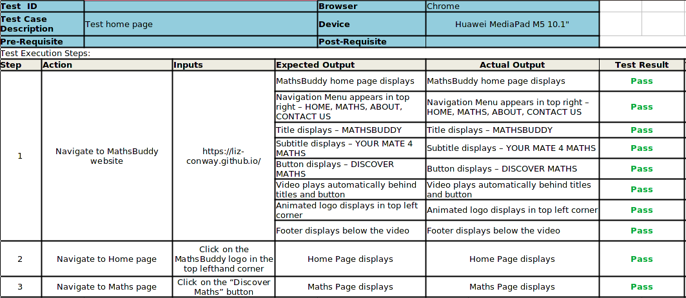

**Home page - Tablet Portrait - Firefox**


**Home page - Tablet Portrait - Chrome**
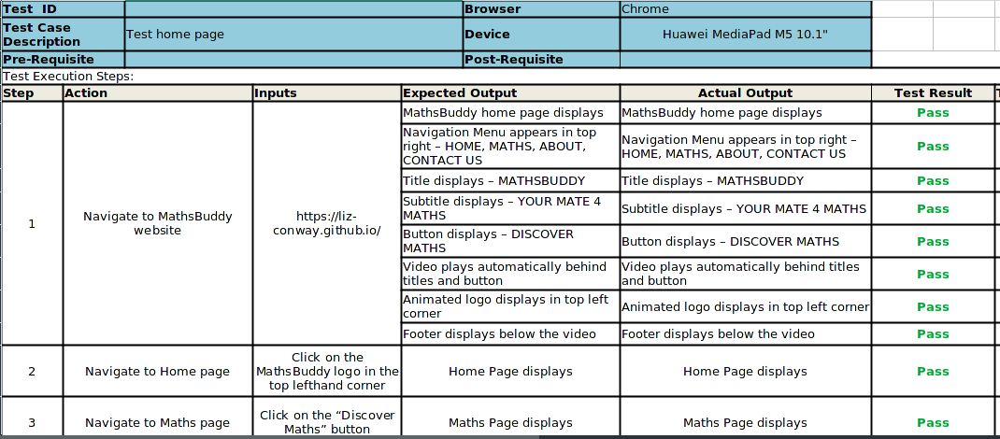

**Home page - Phone - Firefox**
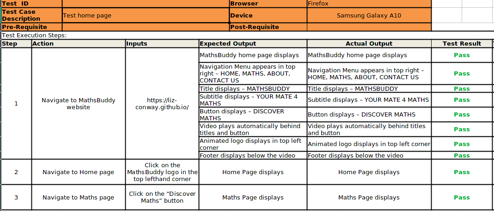

**Home page - Phone - Chrome**


**Maths page - Laptop - Firefox**

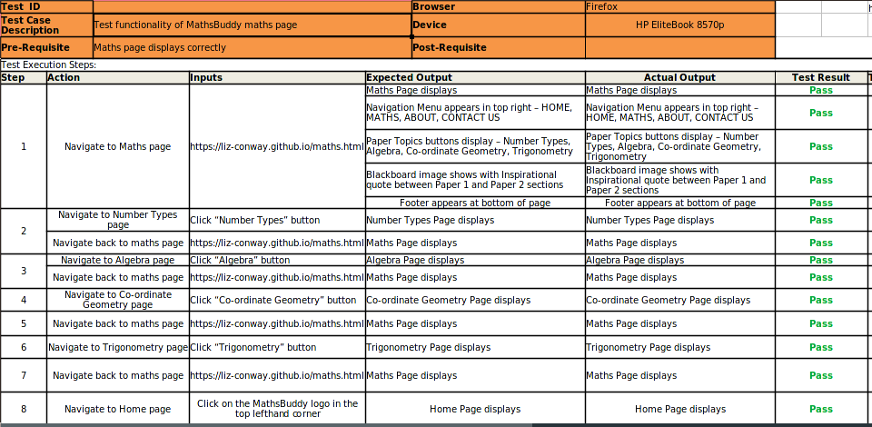

**Maths page - Laptop - Chrome**

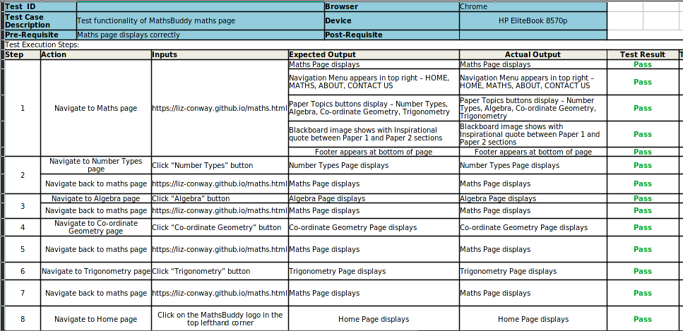

**Maths page - Tablet Landscape - Firefox**

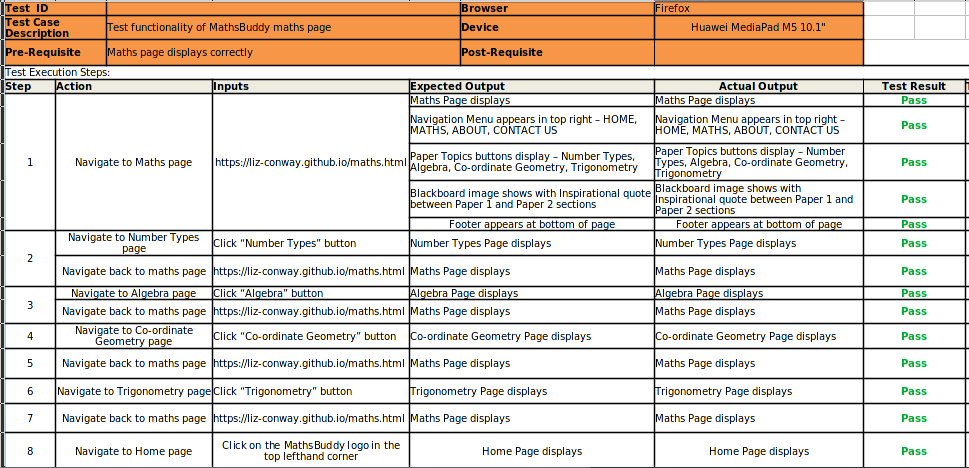

**Maths page - Tablet Landscape - Chrome**

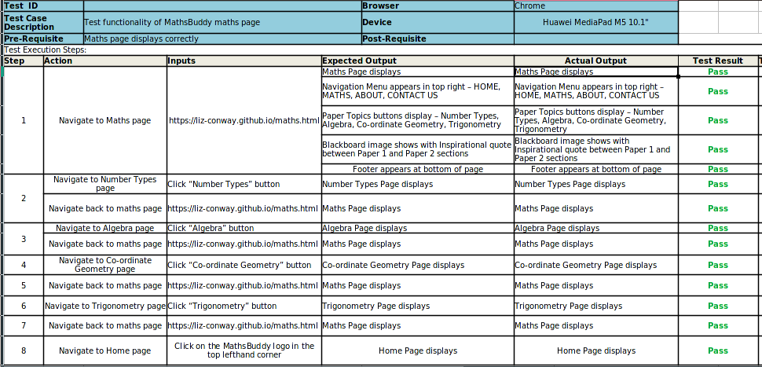

**Maths page - Tablet Portrait - Firefox**

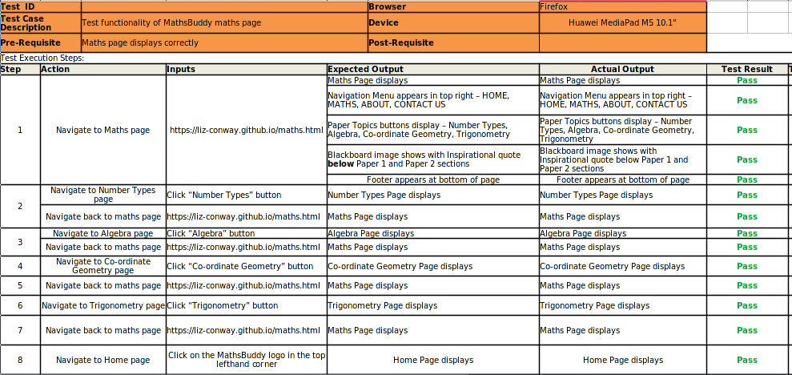

**Maths page - Tablet Portrait - Chrome**


**Maths page - Phone - Firefox**

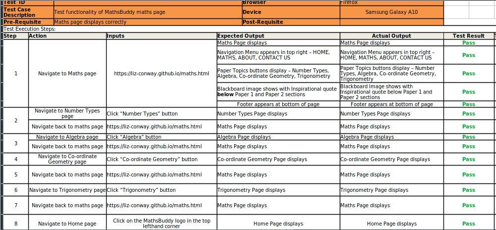

**Maths page - Phone - Chrome**

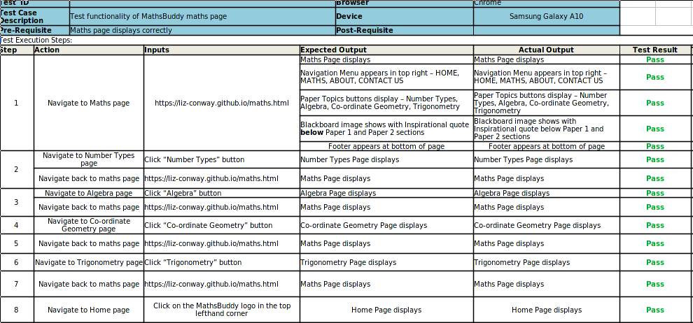

**About page - Laptop - Firefox**


**About page - Laptop - Chrome**


**About page - Tablet Landscape - Firefox**
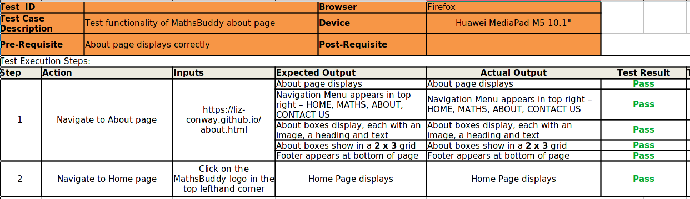

**About page - Tablet Landscape - Chrome**
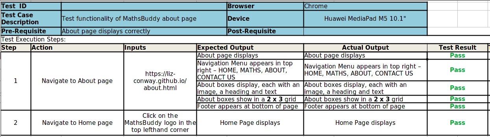

**About page - Tablet Portrait - Firefox**


**About page - Tablet Portrait - Chrome**
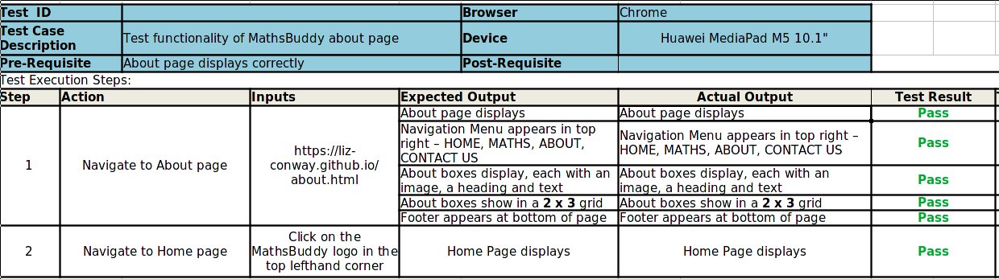

**About page - Phone - Firefox**
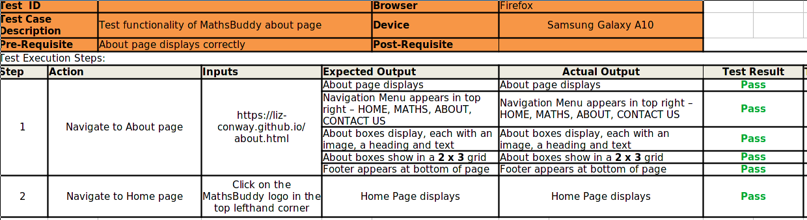

**About page - Phone - Chrome**


**Contact Us page - Laptop - Firefox**


**Contact Us page - Laptop - Chrome**


**Contact Us page - Tablet Landscape - Firefox**


**Contact Us page - Tablet Landscape - Chrome**


**Contact Us page - Tablet Portrait - Firefox**


**Contact Us page - Tablet Portrait - Chrome**


**Contact Us page - Phone - Firefox**


**Contact Us page - Phone - Chrome**


**Number Types page - Laptop - Firefox**


**Number Types page - Laptop - Chrome**


**Number Types page - Tablet Landscape - Firefox**


**Number Types page - Tablet Landscape - Chrome**


**Number Types page - Tablet Portrait - Firefox**


**Number Types page - Tablet Portrait - Chrome**


**Number Types page - Phone - Firefox**


**Number Types page - Phone - Chrome**


**Algebra page - Laptop - Firefox**


**Algebra page - Laptop - Chrome**


**Algebra page - Tablet Landscape - Firefox**


**Algebra page - Tablet Landscape - Chrome**


**Algebra page - Tablet Portrait - Firefox**


**Algebra page - Tablet Portrait - Chrome**


**Algebra page - Phone - Firefox**


**Algebra page - Phone - Chrome**


**Co-ordinate Geometry page - Laptop - Firefox**


**Co-ordinate Geometry page - Laptop - Chrome**


**Co-ordinate Geometry page - Tablet Landscape - Firefox**


**Co-ordinate Geometry page - Tablet Landscape - Chrome**


**Co-ordinate Geometry page - Tablet Portrait - Firefox**


**Co-ordinate Geometry page - Tablet Portrait - Chrome**


**Co-ordinate Geometry page - Phone - Firefox**


**Co-ordinate Geometry page - Phone - Chrome**


**Trigonometry page - Laptop - Firefox**

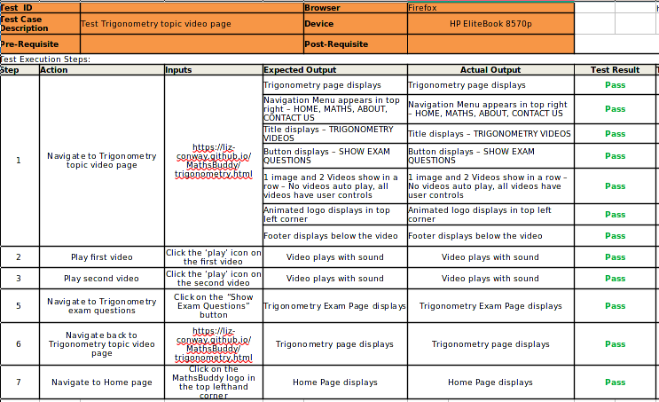

**Trigonometry page - Laptop - Chrome**


**Trigonometry page - Tablet Landscape - Firefox**


**Trigonometry page - Tablet Landscape - Chrome**


**Trigonometry page - Tablet Portrait - Firefox**


**Trigonometry page - Tablet Portrait - Chrome**


**Trigonometry page - Phone - Firefox**


**Trigonometry page - Phone - Chrome**


**Exam Questions > Number Types page - Laptop - Firefox**


**Exam Questions > Number Types page - Laptop - Chrome**


**Exam Questions > Number Types page - Tablet Landscape - Firefox**


**Exam Questions > Number Types page - Tablet Landscape - Chrome**


**Exam Questions > Number Types page - Tablet Portrait - Firefox**


**Exam Questions > Number Types page - Tablet Portrait - Chrome**


**Exam Questions > Number Types page - Phone - Firefox**


**Exam Questions > Number Types page - Phone - Chrome**


**Exam Questions > Algebra page - Laptop - Firefox**


**Exam Questions > Algebra page - Laptop - Chrome**


**Exam Questions > Algebra page - Tablet Landscape - Firefox**


**Exam Questions > Algebra page - Tablet Landscape - Chrome**


**Exam Questions > Algebra page - Tablet Portrait - Firefox**


**Exam Questions > Algebra page - Tablet Portrait - Chrome**


**Exam Questions > Algebra page - Phone - Firefox**


**Exam Questions > Algebra page - Phone - Chrome**


**Exam Questions > Co-ordinate Geometry page - Laptop - Firefox**


**Exam Questions > Co-ordinate Geometry page - Laptop - Chrome**


**Exam Questions > Co-ordinate Geometry page - Tablet Landscape - Firefox**


**Exam Questions > Co-ordinate Geometry page - Tablet Landscape - Chrome**


**Exam Questions > Co-ordinate Geometry page - Tablet Portrait - Firefox**


**Exam Questions > Co-ordinate Geometry page - Tablet Portrait - Chrome**


**Exam Questions > Co-ordinate Geometry page - Phone - Firefox**


**Exam Questions > Co-ordinate Geometry page - Phone - Chrome**

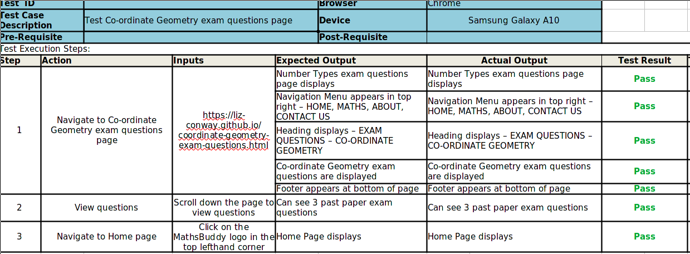

**Exam Questions > Trigonometry page - Laptop - Firefox**


**Exam Questions > Trigonometry page - Laptop - Chrome**


**Exam Questions > Trigonometry page - Tablet Landscape - Firefox**


**Exam Questions > Trigonometry page - Tablet Landscape - Chrome**


**Exam Questions > Trigonometry page - Tablet Portrait - Firefox**


**Exam Questions > Trigonometry page - Tablet Portrait - Chrome**


**Exam Questions > Trigonometry page - Phone - Firefox**


**Exam Questions > Trigonometry page - Phone - Chrome**


**Navigation > Main NavBar - Laptop - Firefox**


**Navigation > Main NavBar - Laptop - Chrome**

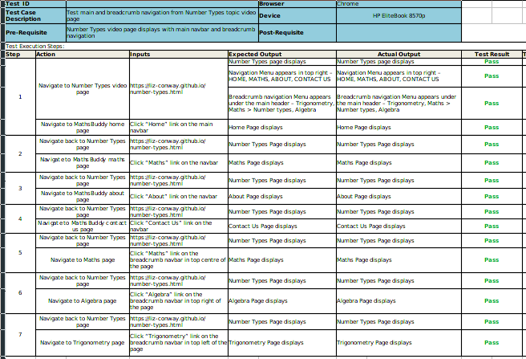

**Navigation > Main NavBar - Tablet Landscape - Firefox**


**Navigation > Main NavBar - Tablet Landscape - Chrome**


**Navigation > Main NavBar - Tablet Portrait - Firefox**


**Navigation > Main NavBar - Tablet Portrait - Chrome**


**Navigation > Main NavBar - Phone - Firefox**

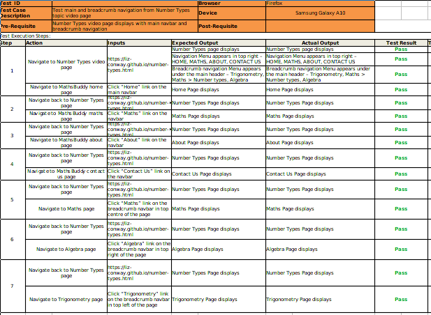

**Navigation > Main NavBar - Phone - Chrome**


**Navigation > Number Types - Laptop - Firefox**


**Navigation > Number Types - Laptop - Chrome**


**Navigation > Number Types - Tablet Landscape - Firefox**


**Navigation > Number Types - Tablet Landscape - Chrome**


**Navigation > Number Types - Tablet Portrait - Firefox**


**Navigation > Number Types - Tablet Portrait - Chrome**


**Navigation > Number Types - Phone - Firefox**


**Navigation > Number Types - Phone - Chrome**


**Navigation > Algebra - Laptop - Firefox**


**Navigation > Algebra - Laptop - Chrome**


**Navigation > Algebra - Tablet Landscape - Firefox**


**Navigation > Algebra - Tablet Landscape - Chrome**


**Navigation > Algebra - Tablet Portrait - Firefox**


**Navigation > Algebra - Tablet Portrait - Chrome**


**Navigation > Algebra - Phone - Firefox**


**Navigation > Algebra - Phone - Chrome**


**Navigation > Co-ordinate Geometry - Laptop - Firefox**


**Navigation > Co-ordinate Geometry - Laptop - Chrome**


**Navigation > Co-ordinate Geometry - Tablet Landscape - Firefox**


**Navigation > Co-ordinate Geometry - Tablet Landscape - Chrome**


**Navigation > Co-ordinate Geometry - Tablet Portrait - Firefox**


**Navigation > Co-ordinate Geometry - Tablet Portrait - Chrome**


**Navigation > Co-ordinate Geometry - Phone - Firefox**


**Navigation > Co-ordinate Geometry - Phone - Chrome**


**Navigation > Trigonometry - Laptop - Firefox**


**Navigation > Trigonometry - Laptop - Chrome**


**Navigation > Trigonometry - Tablet Landscape - Firefox**


**Navigation > Trigonometry - Tablet Landscape - Chrome**


**Navigation > Trigonometry - Tablet Portrait - Firefox**


**Navigation > Trigonometry - Tablet Portrait - Chrome**


**Navigation > Trigonometry - Phone - Firefox**

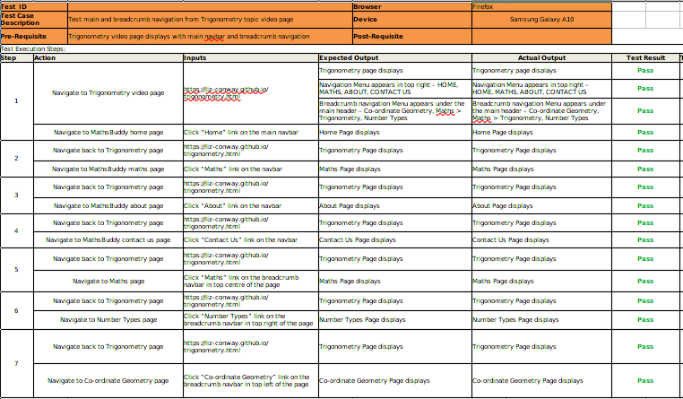

**Navigation > Trigonometry - Phone - Chrome**


**Navigation > Exam Questions > Number Types - Laptop - Firefox**


**Navigation > Exam Questions > Number Types - Laptop - Chrome**


**Navigation > Exam Questions > Number Types - Tablet Landscape - Firefox**


**Navigation > Exam Questions > Number Types - Tablet Landscape - Chrome**


**Navigation > Exam Questions > Number Types - Tablet Portrait - Firefox**

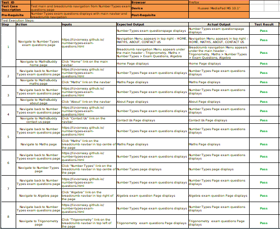

**Navigation > Exam Questions > Number Types - Tablet Portrait - Chrome**


**Navigation > Exam Questions > Number Types - Phone - Firefox**


**Navigation > Exam Questions > Number Types - Phone - Chrome**


**Navigation > Exam Questions > Algebra - Laptop - Firefox**


**Navigation > Exam Questions > Algebra - Laptop - Chrome**


**Navigation > Exam Questions > Algebra - Tablet Landscape - Firefox**


**Navigation > Exam Questions > Algebra - Tablet Landscape - Chrome**


**Navigation > Exam Questions > Algebra - Tablet Portrait - Firefox**


**Navigation > Exam Questions > Algebra - Tablet Portrait - Chrome**


**Navigation > Exam Questions > Algebra - Phone - Firefox**


**Navigation > Exam Questions > Algebra - Phone - Chrome**


**Navigation > Exam Questions > Co-ordinate Geometry - Laptop - Firefox**


**Navigation > Exam Questions > Co-ordinate Geometry - Laptop - Chrome**


**Navigation > Exam Questions > Co-ordinate Geometry - Tablet Landscape - Firefox**


**Navigation > Exam Questions > Co-ordinate Geometry - Tablet Landscape - Chrome**


**Navigation > Exam Questions > Co-ordinate Geometry - Tablet Portrait - Firefox**


**Navigation > Exam Questions > Co-ordinate Geometry - Tablet Portrait - Chrome**


**Navigation > Exam Questions > Co-ordinate Geometry - Phone - Firefox**


**Navigation > Exam Questions > Co-ordinate Geometry - Phone - Chrome**


**Navigation > Exam Questions > Trigonometry - Laptop - Firefox**


**Navigation > Exam Questions > Trigonometry - Laptop - Chrome**


**Navigation > Exam Questions > Trigonometry - Tablet Landscape - Firefox**


**Navigation > Exam Questions > Trigonometry - Tablet Landscape - Chrome**


**Navigation > Exam Questions > Trigonometry - Tablet Portrait - Firefox**


**Navigation > Exam Questions > Trigonometry - Tablet Portrait - Chrome**


**Navigation > Exam Questions > Trigonometry - Phone - Firefox**


**Navigation > Exam Questions > Trigonometry - Phone - Chrome**


#### Known Bugs
Number types exam questions says 16 questions but it only has 4.

Image on Trigonometry topic page (5.1KB) does not have a smaller image to display on smaller screens

#### Validation
CSS was validated using [W3C CSS validator](https://jigsaw.w3.org/css-validator/validator)


HTML was validated on all pages using [W3C HTML validator](https://validator.w3.org/)

Home Page


Maths Page


About Page


Contact Us Page


Number Types video page


Algebra video Page


Co-ordinate Geometry video Page


Trigonometry video Page


Number Types exam questions Page


Algebra exam questions Page


Co-ordinate Geometry exam questions Page


Trigonometry exam questions Page


404 Error page


#### Documentation  
- README.md :  Comprehensive overview of the MathsBuddy website detailing how it works, what its features are, the technologies involved and all the design decisions that were made in creating this learning resource.
- [Vision doc](documentation/MathsBuddy-Vision.docx) :  Business needs and feature list.

- Site map :  Basic site map with prioritisation and categorisation of each page.

#### Deployment 
This project is deployed to [Github Pages](https://liz-conway.github.io/MathsBuddy/)

1. Push the code to Github using ```git push```.

2. Go to the Github repository [MathsBuddy github repository](https://github.com/Liz-Conway/MathsBuddy)

3. In the Github repository, click on the *Settings* menu option.


4. Scroll down to and select the *Pages* section.


5. Choose the *main* branch to deploy


6. After a few minutes the site was deployed.
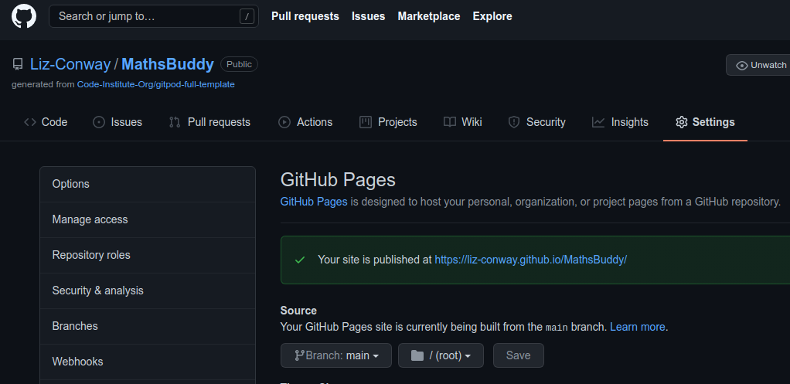

## Technology Used

### Some of the technology used includes:
- [HTML5](https://dev.w3.org/html5/spec-LC/)
    - **HTML5** is used to develop the content of the MathsBuddy website.
- [CSS](https://www.w3.org/Style/CSS/Overview.en.html)
    - **CSS** is used to layout the HTML elements on each page of the MathsBuddy website.
- [FlexBox](https://www.w3.org/TR/css-flexbox-1/)
    - **FlexBox** is used to give the MathsBuddy website a simple, responsive layout.
 
## Contributing

### Clone
1. Firstly you will need to clone this repository by running the ```git clone https://github.com/Liz-Conway/MathsBuddy.git``` command
2. After you've that you'll need to make sure that you have a package manager such as **npm**  installed
  1. You can get **npm** by installing Node from [here](https://nodejs.org/en/)
3. Make sure that you have **live-server** installed. You can install this by running the following: ```npm install -g live-server``` .  This also may require sudo on Mac/Linux
4. Once **live-server** is installed run ```live-server``` in the root directory (the one where index.html is).
5. The project will now run on [localhost](http://127.0.0.1:8080)
6. Make changes to the code and if you think it belongs in here then just submit a pull request.

### Fork
1. Log into [Github](https://github.com/)
2. Search for **MathsBuddy** and choose to go to ```Liz-Conway/MathsBuddy```.
3. Click on the *Fork* button on the top right hand side of the screen.
4. This will make a copy of **MathsBuddy** in your github account.
5. In your version of MathsBuddy click on the ```code``` button and copy the clone text.
6. Then, you will need to clone this repository by pasting the command you just copied into a terminal window on your computer and running it.  This will create a copy of MathsBuddy from your github account on your computer.
7. After you've that you'll need to make sure that you have a package manager such as **npm**  installed
  1. You can get **npm** by installing Node from [here](https://nodejs.org/en/)
8. Make sure that you have **live-server** installed. You can install this by running the following: ```npm install -g live-server```  This also may require sudo on Mac/Linux
9. Once **live-server** is installed run ```live-server``` in the root directory (the one where index.html is).
10. The project will now run on [localhost](http://127.0.0.1:8080)
11. Make changes to the code and run ```git push``` to save those changes to your github account.


### Cloning versus Forking
The major difference between cloning and forking is where your updates go when you perform a ```git push```.

With cloning you are pushing the updates to the ```Liz-Conway/MathsBuddy``` repo on github.

With forking you are pushing the updates to your own MathsBuddy repo on github.

## Credits
